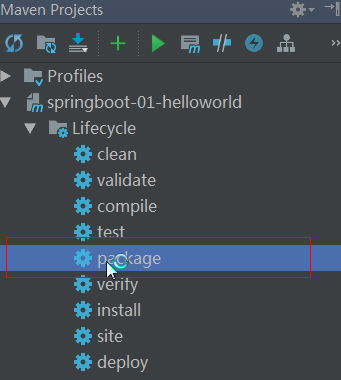

* content 
{:toc}
# 一、Spring Boot 入门

## 1、Spring Boot 简介

> 简化Spring应用开发的一个框架；
>
> 整个Spring技术栈的一个大整合；
>
> J2EE开发的一站式解决方案；

## 2、微服务

2014，martin fowler

微服务：架构风格（服务微化）

一个应用应该是一组小型服务；可以通过HTTP的方式进行互通；

单体应用：ALL IN ONE

微服务：每一个功能元素最终都是一个可独立替换和独立升级的软件单元；

[详细参照微服务文档](https://martinfowler.com/articles/microservices.html#MicroservicesAndSoa)

## 3、环境准备

<http://www.gulixueyuan.com/> 谷粒学院

环境约束

- jdk1.8：Spring Boot 推荐jdk1.7及以上；java version "1.8.0_112"
- maven3.x：maven 3.3以上版本；Apache Maven 3.3.9
- IntelliJIDEA2017：IntelliJ IDEA 2017.2.2 x64、STS
- SpringBoot 1.5.9.RELEASE：1.5.9；

统一环境；

### 1、MAVEN设置；

给maven 的settings.xml配置文件的profiles标签添加

```xml
<profile>
  <id>jdk-1.8</id>
  <activation>
    <activeByDefault>true</activeByDefault>
    <jdk>1.8</jdk>
  </activation>
  <properties>
    <maven.compiler.source>1.8</maven.compiler.source>
    <maven.compiler.target>1.8</maven.compiler.target>
    <maven.compiler.compilerVersion>1.8</maven.compiler.compilerVersion>
  </properties>
</profile>
```

### 2、IDEA设置

整合maven进来；

## 4、Spring Boot HelloWorld

一个功能：

浏览器发送hello请求，服务器接受请求并处理，响应Hello World字符串；

### 1、创建一个maven工程；（jar）

### 2、导入spring boot相关的依赖

```xml
    <parent>
        <groupId>org.springframework.boot</groupId>
        <artifactId>spring-boot-starter-parent</artifactId>
        <version>1.5.9.RELEASE</version>
    </parent>
    <dependencies>
        <dependency>
            <groupId>org.springframework.boot</groupId>
            <artifactId>spring-boot-starter-web</artifactId>
        </dependency>
    </dependencies>
```

### 3、编写一个主程序：启动Spring Boot应用

```java
@SpringBootApplication
public class Application {

    public static void main(String[] args) {
        
        // Spring应用启动起来
        SpringApplication.run(Application.class, args);
    }
}
```

### 4、编写相关的Controller、Service

```java
@Controller
public class HelloController {

    @ResponseBody
    @RequestMapping("/hello")
    public String hello(){
        return "Hello World!";
    }
}
```

### 5、运行主程序测试

直接右键run`Application`

### 6、简化部署



在pom/xml文件引用插件

```xml
 <!-- 这个插件，可以将应用打包成一个可执行的jar包；-->
    <build>
        <plugins>
            <plugin>
                <groupId>org.springframework.boot</groupId>
                <artifactId>spring-boot-maven-plugin</artifactId>
            </plugin>
        </plugins>
    </build>
```

导入这个maven插件，利用idea打包，生成的jar包，可以使用`java -jar xxx.jar`启动

Spring Boot 使用嵌入式的Tomcat无需再配置Tomcat

## 5、Hello World探究

### 1、POM文件

#### 1、父项目

```xml
<parent>
    <groupId>org.springframework.boot</groupId>
    <artifactId>spring-boot-starter-parent</artifactId>
    <version>1.5.9.RELEASE</version>
</parent>
```

他的父项目是：

```xml
<parent>
  <groupId>org.springframework.boot</groupId>
  <artifactId>spring-boot-dependencies</artifactId>
  <version>1.5.9.RELEASE</version>
  <relativePath>../../spring-boot-dependencies</relativePath>
</parent>
```

这是真正管理Spring Boot应用里面所依赖的版本

Spring Boot的版本仲裁中心；

以后我们导入依赖默认是不需要写版本；（没有在dependencies里面管理的依赖自然需要声明版本号）

#### 2、启动器

```xml
<dependency>
    <groupId>org.springframework.boot</groupId>
    <artifactId>spring-boot-starter-web</artifactId>
</dependency>
```

**spring-boot-starter-web**：

spring-boot-starter：spring-boot场景启动器，帮我们导入了web模块正常运行所依赖的组件；

点击进去可以看到帮我们引入很多web相关的依赖

```xml
<?xml version="1.0" encoding="UTF-8"?>
<project xmlns="http://maven.apache.org/POM/4.0.0" xmlns:xsi="http://www.w3.org/2001/XMLSchema-instance" xsi:schemaLocation="http://maven.apache.org/POM/4.0.0 http://maven.apache.org/xsd/maven-4.0.0.xsd">
	<modelVersion>4.0.0</modelVersion>
	<parent>
		<groupId>org.springframework.boot</groupId>
		<artifactId>spring-boot-starters</artifactId>
		<version>1.5.4.RELEASE</version>
	</parent>
	<artifactId>spring-boot-starter-web</artifactId>
	<name>Spring Boot Web Starter</name>
	<description>Starter for building web, including RESTful, applications using Spring
		MVC. Uses Tomcat as the default embedded container</description>
	<url>http://projects.spring.io/spring-boot/</url>
	<organization>
		<name>Pivotal Software, Inc.</name>
		<url>http://www.spring.io</url>
	</organization>
	<properties>
		<main.basedir>${basedir}/../..</main.basedir>
	</properties>
	<dependencies>
		<dependency>
			<groupId>org.springframework.boot</groupId>
			<artifactId>spring-boot-starter</artifactId>
		</dependency>
		<dependency>
			<groupId>org.springframework.boot</groupId>
			<artifactId>spring-boot-starter-tomcat</artifactId>
		</dependency>
		<dependency>
			<groupId>org.hibernate</groupId>
			<artifactId>hibernate-validator</artifactId>
		</dependency>
		<dependency>
			<groupId>com.fasterxml.jackson.core</groupId>
			<artifactId>jackson-databind</artifactId>
		</dependency>
		<dependency>
			<groupId>org.springframework</groupId>
			<artifactId>spring-web</artifactId>
		</dependency>
		<dependency>
			<groupId>org.springframework</groupId>
			<artifactId>spring-webmvc</artifactId>
		</dependency>
	</dependencies>
</project>
```

Spring Boot将所有的功能场景都抽取出来，做成一个个的starters（启动器），只需要在项目里面引入这些starter相关场景的所有依赖都会导入进来，要用什么功能就导入什么场景的启动器

### 2、主程序类，主入口类

```java
package com.atguigu.springboot;

import org.springframework.boot.SpringApplication;
import org.springframework.boot.autoconfigure.SpringBootApplication;

@SpringBootApplication
public class SpringBoot01HelloworldQuickApplication {

   public static void main(String[] args) {
      SpringApplication.run(SpringBoot01HelloworldQuickApplication.class, args);
   }

}
```

@**SpringBootApplication**:  Spring Boot应用标注在某个类上说明这个类是SpringBoot的主配置类，SpringBoot就改运行这个类的main方法来启用SpringBoot应用；

```java
@Target(ElementType.TYPE)
@Retention(RetentionPolicy.RUNTIME)
@Documented
@Inherited
@SpringBootConfiguration
@EnableAutoConfiguration
@ComponentScan(excludeFilters = {
      @Filter(type = FilterType.CUSTOM, classes = TypeExcludeFilter.class),
      @Filter(type = FilterType.CUSTOM, classes = AutoConfigurationExcludeFilter.class) })
public @interface SpringBootApplication {
```

@**SpringBootConfiguration**:Spring Boot的配置类；

​		标注在某个类上，表示Spring Boot的配置类;

​		@**Configuration**:配置类上标注这个注解；

​			配置类—————配置文件；配置类同样是容器中的一个组件;

@**EnableAutoConfiguration**:开启自动配置；

​		以前需要手动配置的内容，Spring Boot自动配置；

```java
@AutoConfigurationPackage
@Import(AutoConfigurationImportSelector.class)
public @interface EnableAutoConfiguration {
```

@**AutoConfigurationPackage**:自动配置包；

​		@**Import**(AutoConfigurationPackages.Registrar.class)；

​		Spring 底层注解@import,给容器导入一个组件；导入组件由AutoConfigurationPackages.Registrar.class

==将主配置类(@SpringBootApplication标注的类)所在包底下所有子包内的组件扫描到Spring容器中；==

​		@Import(AutoConfigurationImportSelector.class);

​			给容器中导入组件？

​			AutoConfigurationImportSelector：导入组件的选择器；

​			将所有需要导入的组件以全类名的方式返回，这些组件就会被添加到容器中；

​			给容器导入许多的自动配置类(xxxAutoConfiguration)；就是给容器导入这个场景需要的所有组件，并配置好这些组件；

​		

有了自动配置类，免去了我们手动配置填写注入功能组件等工作；

​		SpringFactoriesLoader.loadFactoryNames(EnableAutoConfiguration.class,classLoader);

==Spring Boot在启动时从类路径下的META-INF/spring.factories中获取EnableAutoConfiguration指定的值;将这些值作为自动配置类导入到容器中，自动配置类生效，帮我们进行自动配置工作;==以前需要自己配置的内容，Spring Boot帮我们做了；

## 6、使用Spring Initializer快速创建Spring Boot项目

IDEA都支持Spring的项目创建向导快速创建一个Spring Boot项目：


选择所需的模块创建即可；向导联网创建出Spring Boot项目；

默认生成的Spring Boot项目；

* 主程序已生成，只需逻辑
* resourcers文件夹中目录结构
  * static：保存所有的静态资源;js css images;
  * templates:保存所有的模板页面;（Spring Boot默认jar包使用嵌入式的Tomcat，默认不支持JSP页面）；可以使用模板引擎（freemarker、thymeleaf）;
  * application.properties:Spring Boot配置文件；可以修改一些默认的配置；

# 二、配置文件

## 1、配置文件

SpringBoot使用一个全局的配置文件,配置文件名固定

* application.properties
* application.yml


配置文件作用：修改SpringBoot自动配置的默认值；

YAML（YAML Ain't Markup Language）

​	YAML A Markup Language：是一个标记语言

​	YAML isn't Markup Language：不是一个标记语言

标记语言：

​	以前的配置文件：xxxx.xml;

​	YAML：以数据为中心，比json、xml更适合作为配置文件\

​	YAML：配置例子

```yaml
server:
  port: 80
```

​	XML:

```xml
<server>
	<port>80</port>
</server>
```

## 2、YAML语法：

### 1、基本语法

key:[空格]value: 表示一对键值对（空格必须有）;

以空格的缩进来控制层级关系；只要是左对齐的一列数据，都是同一个层级的

```yaml
server:
	port: 80
	path: /hello
```

属性和值大小写敏感;(属性和值之间也有空格)

### 2、值的写法

**字面量；普通的值（数字，字符串，布尔）**

​	k: v: 字面直接来写；

​		字符串默认不同加上单引号或者双引号；

​		“”：双引号：不会转义特殊字符串里的特殊字符；字符串会作为本身想表示的意思；

​			name:“zhangsan \n list”：输出：zhangsan 换行 list

​		''：单引号：转义特殊字符，特殊字符最终以字符串输出

​			name:“zhangsan \n list”：输出：zhangsan \n list

**对象（属性和值）（键值对）：**

​	k: v:在下一行写对象的属性和值的关系；注意缩进

​		对象还是k: v:的方式

```yaml
friends:
	lastname: zhangsan
	age: 20
```

行内写法：

```yaml
friends: {lastname: zhangsan,age: 18}
```


**数组（List、Set）:**

用-值表示数组中的一个元素

```yaml
pets:
 - cat
 - dog
 - pig
```

行内写法：

```yaml
pets: [cat,dog,pig]
```

